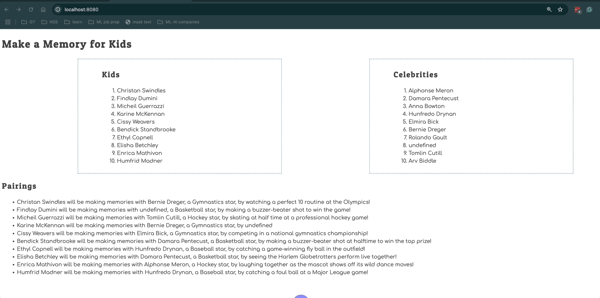

# Events and Debugging Assessment

Time to assess how well you have learned to use the debugging tools in Chrome Dev Tools, and writing click event listeners. This application is to show kids with illnesses and the memories the would like to make. Celebrities sign up to help kids make memories.

> 🧨 Make sure you answer the vocabulary and understanding questions at the end of this document before notifying your coaches that you are done with the project

## Event Listeners to Create

1. When the kid name is clicked, it should display their wish.
1. When the celebrity name is clicked, it should display their sport.
1. The pairings list should should contain the pairing in the following format.
    ```html
    {child name} will be making memories with {celebrity name}, a {celebrity sport} star, by {child wish}
    ```

Below is an animation showing how the application should look when complete and how the event listeners should work.



## Setup

Your instruction team will provide a link for you to create your assessment repository. Once your repo is created, clone it to your machine.

1. Make sure you are in your `workspace` directory.
1. `git clone {github repo SSH string}`.
1. `cd` into the directory it creates.
1. `code .` to open the project code.
1. Use the `serve` command to start the web server.
1. Open the URL provided in Chrome.

Make sure your Developer Tools are open at all times while working on this project. Use the messages provided in the Console to determine what code needs to be fixed or implemented, and use breakpoints in the Sources tab to step through your code as you debug.

## Vocabulary and Understanding

Before you click the "Complete Assessment" button on the Learning Platform, add your answers below each question and make a commit.

1. When a child is clicked on in the browser, which module contains the code that will execute on that event happening? Can you explain the algorithm of that logic?
   > The module is Kids.js. When the event listener notices a click, it checks the datatype of the clicked item, and if the data type is "child", it will save the id of that child in a variable. Using a for of loop, it will check to see if the id of that child matches the one in the database, and if it does, it returns a window alert describing the child's name and wish.
2. In the **Pairings** module, why must the `findCelebrityMatch()` function be invoked inside the `for..of` loop that iterates the kids array?
   > In order for the Pairings function to do it's job, it needs to invoke the findCelebrityMatch function during every cycle of it's for of loop, otherwise only one pairing could be generated.
3. In the **CelebrityList** module, can you describe how the name of the sport that the celebrity plays can be displayed in the window alert text?
   > By matching the id of the clicked item to the id of a celebrity in the celebrities array using a for of loop, both the celebrity name and sport can be referenced directly from the celebrities array.
4. Can you describe, in detail, the algorithm that is in the `main` module?
   > After importing all the necessary functions from the other modules, main.js targets the container id inside the index.html document and saves that target in a variable. Next, a variable if defined which holds HTML that is generated through the three important functions. Lastly, this variable overwrites the innerHTML of the previously targeted DOM with the newly generated HTML.
